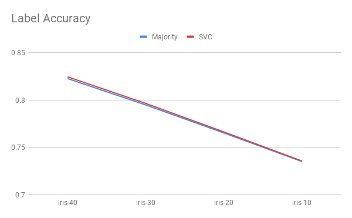
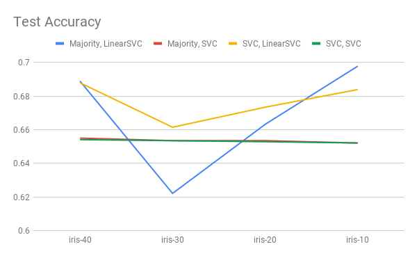

## Cluster-then label approach on Iris dataset
Updated: 29.3.2019

### What is cluster-then-label?
Cluster-then-label is a method of labelling unlabelled data, prior to 
training a classifier on all self-labelled data.

The step-by-step algorithm is as below (refer to [Zhu and Goldberg]()):

Input: labelled data (X*l*, Y*l*), 
       unlabelled data X*u*,
       clustering algorithm C, supervised learning algorithm S.
       
1. Cluster (X*l*, Y*l*) with C.
2. For each resulting cluster,
    * If the cluster contains labelled instance, train a predictor 
      on the labelled instance using S.
    * Else, train S on all labelled data (X*l*, Y*l*)
    * Apply S to all unlabelled instance in this cluster.
3. Train another supervised learning algorithm on all data after labelling.

Here,  we use **K-means** as the clustering algorithm, and we set the number of
clusters = the number of classes in the labels. We use 
**majority vote** and **SVM** to learn patterns within the cluster.

For the final classifier, we try **SVM** with linear and RBF kernel.

### Results
##### Iris dataset (average taken acros 10-folds):

Majority + LinearSVC | iris-40 | iris-30 | iris-20 | iris-10
:---: | :---: | :---: | :---: | :---: 
Label acc | 0.9229 | 0.9157 | 0.8888 | 0.8799 
Test acc | 0.9332 | 0.9256 | 0.8931 | 0.8666 

Majority + SVC | iris-40 | iris-30 | iris-20 | iris-10
:---: | :---: | :---: | :---: | :---: 
Label acc | 0.9229 | 0.9157 | 0.8888 | 0.8799 
Test acc | 0.9133 | 0.9 | 0.8666 | 0.8666 

SVC + LinearSVC | iris-40 | iris-30 | iris-20 | iris-10
:---: | :---: | :---: | :---: | :---: 
Label acc | 0.9303 | 0.9237 | 0.9170 | 0.9096 
Test acc | 0.9333 | 0.9533 | 0.92 | 0.8999 

SVC + SVC | iris-40 | iris-30 | iris-20 | iris-10
:---: | :---: | :---: | :---: | :---: 
Label acc | 0.9303 | 0.9237 | 0.9170 | 0.9096 
Test acc | 0.8933 | 0.8999 | 0.8933 | 0.9266

Comparison of each method are visualized as below:

 
 

##### Magic dataset (average taken across 10-folds):

Majority + LinearSVC | magic-40 | magic-30 | magic-20 | magic-10
:---: | :---: | :---: | :---: | :---: 
Label acc | 0.8228 | 0.7949 | 0.7653 | 0.7351 
Test acc | 0.6889 | 0.6221 | 0.6632 | 0.6978 

Majority + SVC | magic-40 | magic-30 | magic-20 | magic-10
:---: | :---: | :---: | :---: | :---: 
Label acc | 0.8228 | 0.7949 | 0.7654 | 0.7351 
Test acc | 0.6541 | 0.6535 | 0.6529 | 0.6521 

SVC + LinearSVC | magic-40 | magic-30 | magic-20 | magic-10
:---: | :---: | :---: | :---: | :---: 
Label acc | 0.8247 | 0.7965 | 0.7664 | 0.7357 
Test acc | 0.6879 | 0.6615 | 0.6733 | 0.6839 

SVC + SVC | magic-40 | magic-30 | magic-20 | magic-10
:---: | :---: | :---: | :---: | :---: 
Label acc | 0.8247 | 0.7965 | 0.7664 | 0.7357 
Test acc | 0.6541 | 0.6534 | 0.6529 | 0.6521

Comparison of each method are visualized as below:

 
 

### To-do
- [ ] Use other clustering algorithms (hierachical agglomerative), observer
how different clustering affects the performance
- [ ] Comparison with baselines (upper bound - supervised learning on all 
data labelled, lower bound - supervised learning on all visible labelled data)
- [ ] Different datasets should have different models that suits best. We
can find the best that suits for each, find its lower and upper bounds,
and compare on each of the different mechanisms.
- [ ] Run on MNIST data
- [X] Use supervised classifier other than majority vote for classifiying in clusters.