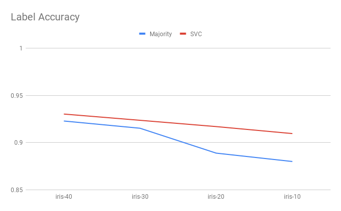
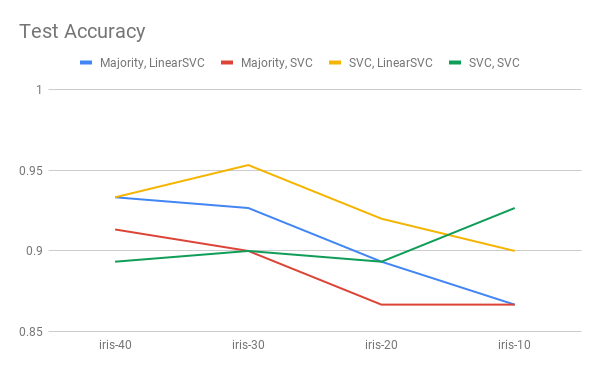
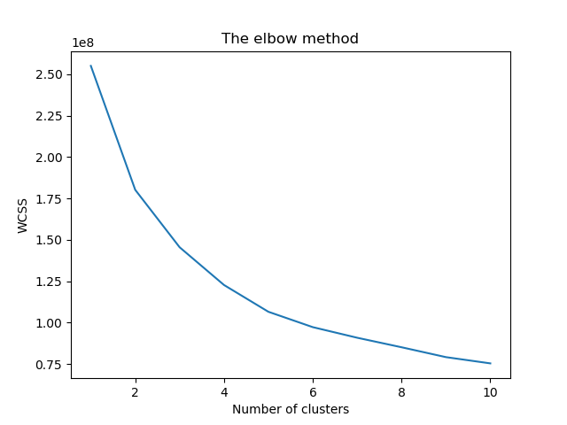

## Cluster-then label approach on Iris dataset
Updated: 29.3.2019

### What is cluster-then-label?
Cluster-then-label is a method of labelling unlabelled data, prior to 
training a classifier on all self-labelled data.

The step-by-step algorithm is as below (refer to [Zhu and Goldberg]()):

Input: labelled data (X*l*, Y*l*), 
       unlabelled data X*u*,
       clustering algorithm C, supervised learning algorithm S.
       
1. Cluster (X*l*, Y*l*) with C.
2. For each resulting cluster,
    * If the cluster contains labelled instance, train a predictor 
      on the labelled instance using S.
    * Else, train S on all labelled data (X*l*, Y*l*)
    * Apply S to all unlabelled instance in this cluster.
3. Train another supervised learning algorithm on all data after labelling.

Here,  we use **K-means** as the clustering algorithm, and we set the number of
clusters = the number of classes in the labels. We use 
**majority vote** and **SVM** to learn patterns within the cluster.

For the final classifier, we try **SVM** with linear and RBF kernel.

### Results
##### Iris dataset (average taken acros 10-folds):

Majority + LinearSVC | iris-40 | iris-30 | iris-20 | iris-10
:---: | :---: | :---: | :---: | :---: 
Label acc | 0.9229 | 0.9157 | 0.8888 | 0.8799 
Test acc | 0.9332 | 0.9256 | 0.8931 | 0.8666 

Majority + SVC | iris-40 | iris-30 | iris-20 | iris-10
:---: | :---: | :---: | :---: | :---: 
Label acc | 0.9229 | 0.9157 | 0.8888 | 0.8799 
Test acc | 0.9133 | 0.9 | 0.8666 | 0.8666 

SVC + LinearSVC | iris-40 | iris-30 | iris-20 | iris-10
:---: | :---: | :---: | :---: | :---: 
Label acc | 0.9303 | 0.9237 | 0.9170 | 0.9096 
Test acc | 0.9333 | 0.9533 | 0.92 | 0.8999 

SVC + SVC | iris-40 | iris-30 | iris-20 | iris-10
:---: | :---: | :---: | :---: | :---: 
Label acc | 0.9303 | 0.9237 | 0.9170 | 0.9096 
Test acc | 0.8933 | 0.8999 | 0.8933 | 0.9266

Comparison of each method are visualized as below:

 
 

  

##### Magic dataset (average taken across 10-folds):
Experiment 1: Optimal number of clusters.

Run on majority vote + decision trees setting in magic-10.

Number of clusters | Label Accuracy | Test Accuracy
:---: | :---: | :---: 
1 | 0.6857 | 0.6704
2 | 0.6804 | 0.6609
<b>3 | 0.7357 | 0.7128</b>
4 | 0.7242 | 0.7108
5 | 0.7236 | 0.7106
6 | 0.7269 | 0.7117

Hence, we set the optimal number of cluster to be **3**. It corresponds to 
elbow diagram as below. This shows that the optimal number of clusters
do not necessarily equal to the number of classes.

 

 

Experiment 2: Optimal supervised predictor within cluster

Run on various models as below to determine the best model to predict
the labels within the clusters.

Label Accuracy | magic-40 | magic-30 | magic-20 | magic-10
:---: | :---: | :---: | :---: | :---: 
Majority Vote | 0.8228 | 0.7949 | 0.7653 | 0.7351 
Decision Tree | 0.8858 | 0.8627 | 0.8384 | 0.8082
**Random Forest** | **0.9141** | **0.8978** | **0.8784** | **0.8541**
KNN(5) | 0.8778 | 0.8557 | 0.8304 | 0.7966
SVC | 0.8247 | 0.7966 | 0.7665 | 0.7357

As seen from the results, random forest yields the best result. Hence,
we will use random forest for self-labelling predictor.

 

Experiment 3: Classify on self-label data

Finally, we find the best classifier that yields the best result
on the self-labelled data.

Label Accuracy | magic-40 | magic-30 | magic-20 | magic-10
:---: | :---: | :---: | :---: | :---: 
Decision Tree | 0.8318 | 0.8345 | 0.8332 | 0.8265
**Random Forest** | **0.8606** | **0.8590** | **0.8544** | **0.8440**
KNN(5) | 0.8082 | 0.8091 | 0.807 | 0.8061

From here, we can see that random forest is again the best model
for classifying self-labelled data. This should be the best accuracy
that we could achieve using cluster-and-label approach on MAGIC dataset.

### To-do
- [ ] Use other clustering algorithms (hierachical agglomerative), observer
how different clustering affects the performance
- [ ] Run on MNIST data
- [X] Use supervised classifier other than majority vote for classifiying in clusters.